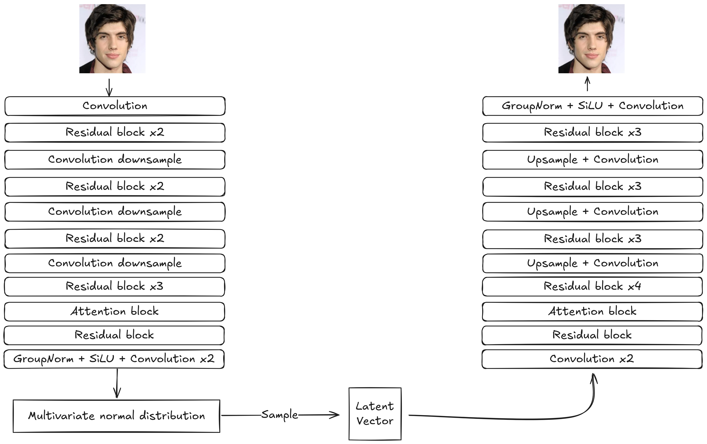
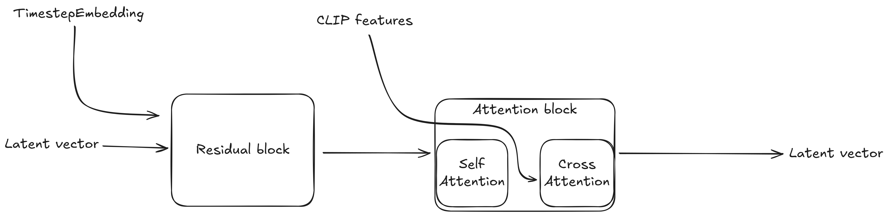
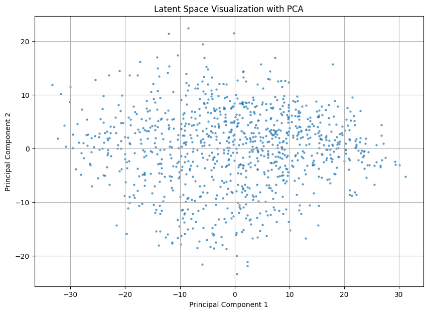
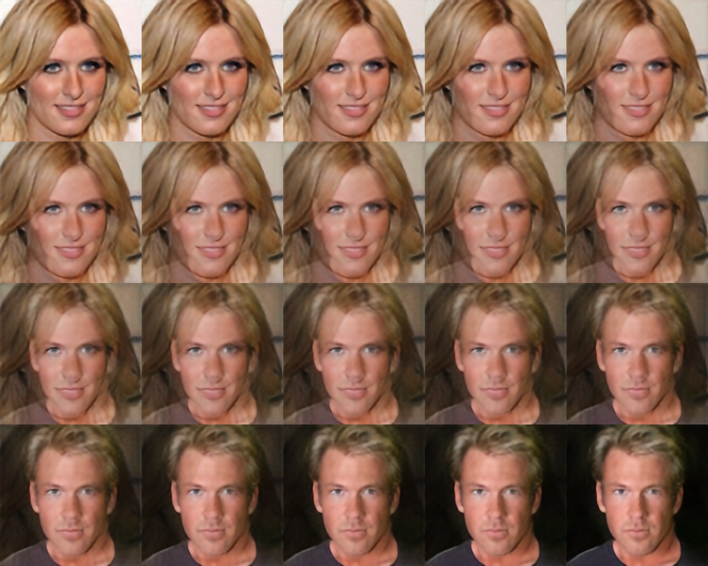
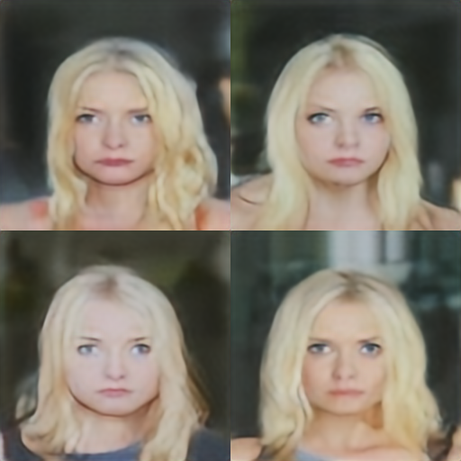
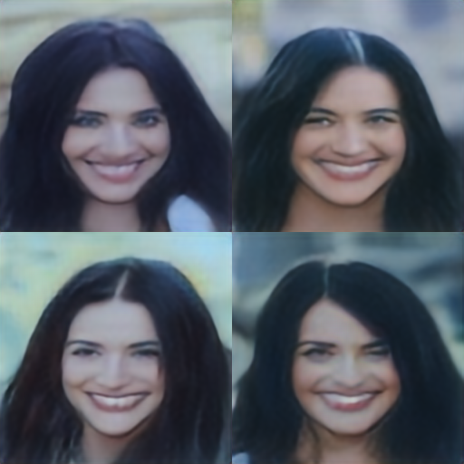
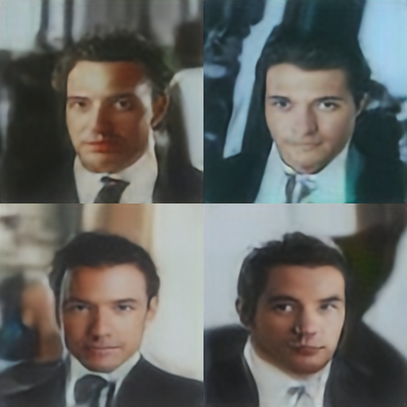

# Face image generation through Stable Diffusion based on CelebA dataset

Repository contains an implementation of a Stable Diffusion architecture trained on [CelebA](https://www.kaggle.com/datasets/jessicali9530/celeba-dataset) dataset.

## Model capabilities

Implemented:

- Face images generation with Classifier Free Guidance through text prompt
- Uncoditioned face image generation (slightly worse performance)

Not yet implemented but possible without retraining:

- Image to image face generation with/without conditioning
- Face image inpainting with/without conditioning

## Project structure

```bash
├── cmd/                     # scripts
├── data/                    # data processing utilities
├── model/                   # Models implementations, UNet, VAE and all building blocks
├── notebooks/               # Jupyter notebooks with visualisations and example usage of the package
├── pipelines/               # Training and inference pipelines
├── runs/                    # Logs and experiment artifacts: samples, losses etc.
```

## Installation
1. Clone the repo
```bash
git clone https://github.com/St0pien/face-diffusion.git
cd face-diffusion
```

2. Prepare your environment (virtualenv or conda)
3. Install dependencies
```bash
pip install -r requirements.txt
```

## Usage
### Data preprocessing
```bash
python cmd/prepare_datasets.py --help
```
### Training
#### VAE
To train VAE use [VAETrainingPipeline](./pipelines/vae_training.py), example usage in this [notebook](./notebooks/vae_train.ipynb)

#### UNet
```bash
python cmd/unet_train.py --help
```

### Generate
Use [FaceDiffusionInferencePipeline](./pipelines/inference.py) example in this [notebook](./notebooks/inference.ipynb)

### Evaluate
#### VAE
```bash
python cmd/vae_eval.py --help
```

#### UNet
```bash
python cmd/unet_eval.py --help
```

## Architecture overview
### General architecture


### VAE


### UNet
Denoising unet is a typical UNet architecture composed of standard modules and few custom blocks. Most of the levels look like this:


## Example results
### VAE
VAE vs original


Validation dataset in latent space


Smooth transition in latent space


### UNet

Prompt: "Young blond actress with serious face"\
Steps: 30\
CFG Scale: 2.0\


Prompt: "Woman with long dark hair smiling"\
Steps: 30\
CFG Scale: 1.5\


Prompt: "Handsome young man in tuxedo"\
Steps: 30\
CFG Scale: 1.5\


## Resources used
- [https://www.kaggle.com/datasets/jessicali9530/celeba-dataset](https://www.kaggle.com/datasets/jessicali9530/celeba-dataset)
- [https://github.com/hkproj/pytorch-stable-diffusion](https://github.com/hkproj/pytorch-stable-diffusion)
- [https://arxiv.org/pdf/2006.11239](https://arxiv.org/pdf/2006.11239)